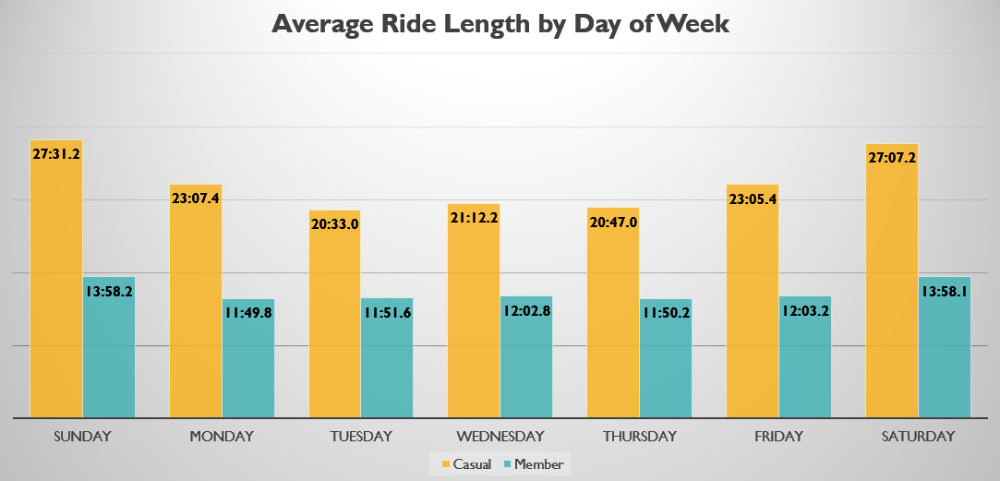

# Cyclists Membership Acquisition

## Introduction

This repository showcases my first capstone project for the Google Data Analytics course through Coursera. The course focused on using the Google Workspace and other resources, so I decided for the first capstone project that I would limit myself to only using the Microsoft suite to strengthen my knowledge around them.

I know that a lot of my analysis was not done 100% efficiently, and I look forward to continuing to explore the Microsoft suite to learn all the ways to increase efficiency through it. All data was accessed through public use via the course itself and is included in my Raw Data folder. I have compiled and zipped all of the raw data, as well as my Excel cleaning files, and uploaded them to a Google Drive that is available in the [Resources](#resources) section of the README.

### Project Goals
- Strengthen knowledge of the Microsoft suite by limiting tools to only Microsoft resources.
- Identify key differences between casual riders and members to uncover strategies for converting casual riders to members.

## Findings

Here are the main things I found:
- **Ride Duration**: Casual riders take longer rides than members.
  
  
- **Ride Frequency**: Casual riders ride more on weekends, while members ride more during the week.
  
  
- **Station Usage**: Casual riders are more prominent at some stations, which could be a chance to convert them to members.
  
  
- **Round Trip Anomaly**: Casual riders are almost twice as likely to return their bikes to the same station they rented them from.
  

## Resources

- [Cyclist Data](https://drive.google.com/file/d/1hBSSHJXQhCOzMIcUL-dwdvXFt241LLNG/view?usp=drive_link)
- [Google Data Analytics Course](https://www.coursera.org/professional-certificates/google-data-analytics)
